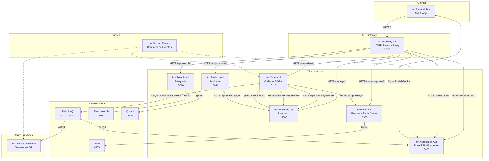

# ITM-Tickets: Festival de los Dos Mundos — Arquitectura

## Diagrama de Arquitectura



## Puertos de Servicios

| Servicio             | Puerto HTTP | Puerto Container |
| -------------------- | ----------- | ---------------- |
| Itm.Gateway.Api      | 5183        | 8080             |
| Itm.Inventory.Api    | 5000        | 8080             |
| Itm.Order.Api        | 5110        | 8080             |
| Itm.Product.Api      | 5041        | 8080             |
| Itm.Price.Api        | 5300        | 8080             |
| Itm.Notification.Api | 5400        | 8080             |
| Itm.Search.Api       | 5500        | 8080             |

| Infraestructura | Puerto                          |
| --------------- | ------------------------------- |
| Redis           | 6379                            |
| RabbitMQ        | 5672 (AMQP), 15672 (Management) |
| Elasticsearch   | 9200                            |
| Qdrant          | 6333 (gRPC)                     |

## Protocolos de Comunicación

| Desde             | Hacia         | Protocolo           | Propósito                  |
| ----------------- | ------------- | ------------------- | -------------------------- |
| Gateway           | Todos los MS  | HTTP/1.1            | Enrutamiento YARP          |
| Order.Api         | Inventory.Api | HTTP/1.1            | Reducir/Liberar stock      |
| Order.Api         | Inventory.Api | gRPC                | CheckStock                 |
| Order.Api         | Price.Api     | HTTP/1.1            | Obtener precio             |
| Product.Api       | Inventory.Api | HTTP/1.1            | Consultar stock            |
| Order.Api         | RabbitMQ      | AMQP 0-9-1          | Publicar OrderCreatedEvent |
| Tickets.Functions | RabbitMQ      | AMQP 0-9-1          | Consumir OrderCreatedEvent |
| Notification.Api  | RabbitMQ      | AMQP 0-9-1          | Consumir OrderCreatedEvent |
| Notification.Api  | MAUI App      | SignalR (WebSocket) | Notificar ticket listo     |
| Price.Api         | Redis         | Redis Serialization | Cache de precios           |
| Search.Api        | Elasticsearch | REST (HTTP)         | Búsqueda textual           |
| Search.Api        | Qdrant        | gRPC                | Búsqueda semántica         |

## Flujo de Compra Exitosa

```
1. MAUI App → Gateway: POST /api/orders { productId:1, quantity:1 }
2. Gateway → Order.Api: Reenvía la request (YARP)
3. Order.Api → Inventory.Api: gRPC CheckStock(ProductId=1)
4. Inventory.Api → Order.Api: StockResponse { IsAvailable=true, Stock=10 }
5. Order.Api → Inventory.Api: HTTP POST /api/inventory/reduce { productId:1, quantity:1 }
6. Inventory.Api → Order.Api: 200 OK { NewStock: 9 }
7. Order.Api → Price.Api: HTTP GET /api/prices/1
   (Price.Api busca en Redis → miss → consulta DB → guarda en Redis → responde)
8. Price.Api → Order.Api: PriceResponse { Amount: 150.00, Source: "Database" }
9. Order.Api: Simula pago exitoso (random > 5)
10. Order.Api → RabbitMQ: Publica OrderCreatedEvent { OrderId, ProductId, CustomerEmail, TotalAmount }
11. Order.Api → MAUI: 200 OK { OrderId, Message: "Orden creada y pagada exitosamente" }

Background:
12. Tickets.Functions ← RabbitMQ: Consume OrderCreatedEvent
13. Tickets.Functions: Genera QR en base64
14. RabbitMQ → Notification.Api: Entrega evento a notification-order-created-queue
15. Notification.Api: Envía TicketReadyDto por SignalR al grupo del email del cliente
16. MAUI App ← SignalR: Recibe ReceiveTicket con QR en base64
17. MAUI App: Muestra el QR en Image control
```

## Flujo de Compensación SAGA (pago falla)

```
1-7. Igual que flujo exitoso hasta obtener precio
8. Order.Api: Simula pago FALLIDO (random <= 5)
9. Order.Api → Inventory.Api: HTTP POST /api/inventory/release { productId:1, quantity:1 }
10. Inventory.Api → Order.Api: 200 OK { NewStock: 10 }
11. Order.Api → MAUI: 500 Error { "El pago falló. El stock fue devuelto correctamente." }

Si la compensación también falla:
11. Order.Api: LOG CRÍTICO "Falló la compensación. Datos inconsistentes."
12. Order.Api → MAUI: 500 Error { "Error crítico del sistema. Contacte soporte." }
```

## Seguridad

- Todos los servicios (excepto Notification y Search) requieren JWT Bearer token.
- JWT configurado con: Issuer="ItmIdentityServer", Audience="ItmStoreApis",
  SecretKey="ITM-Super-Secret-Key-For-JWT-Class-2026-Nivel5"
- Rate limiting en Gateway: 5 req/10s para /api/orders, 30 req/10s para rutas generales.
- Correlation ID (X-Correlation-ID) propagado end-to-end via middleware.
